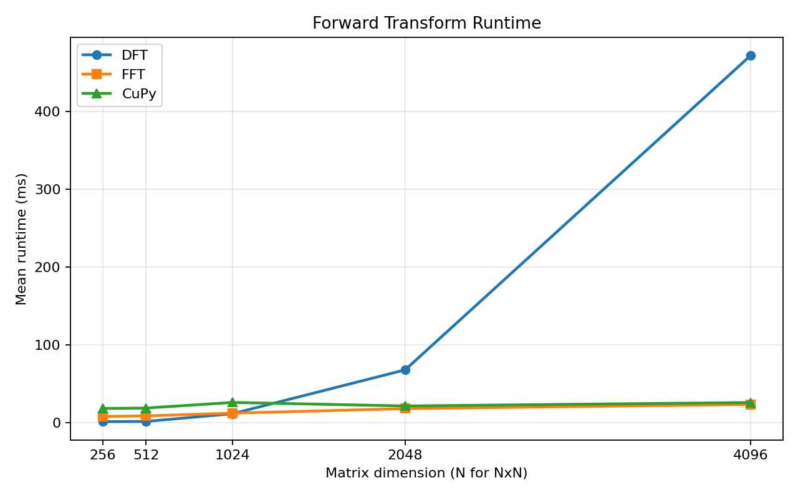
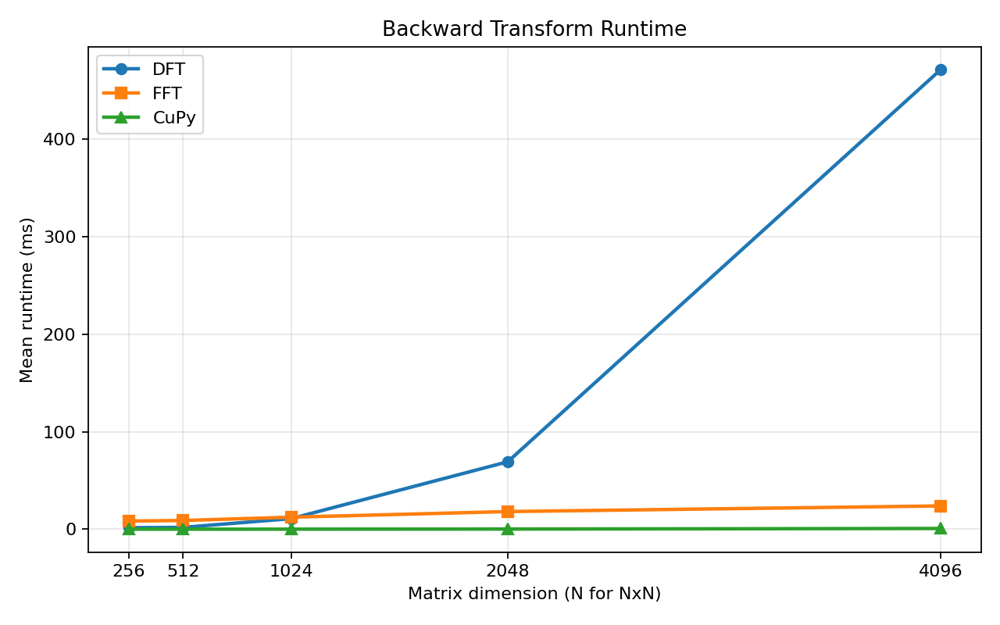

# WebGPU FFT Implementation

## Overview

`wgpu-fft` is a high-performance implementation of the Fourier Transform utilizing WebGPU. The project leverages GPU acceleration to perform efficient transform computations, making it suitable for applications in signal processing, image analysis, and other computational tasks requiring Fourier analysis.

The intention of this project was to integrate it into our [WebGPU IDT Model](https://github.com/bu-cisl/wgpu-ssnp) project. However, given the significance and broader applicability of this module, we decided to make it a standalone repository so that others can also benefit from it.

## Features

- **GPU Acceleration**: Efficient Fourier transform computation using WebGPU for parallel processing
- **Automatic Routing**: Uses the FFT for power-of-2 dimensions and falls back to the DFT otherwise
- **Inverse Transform**: Supports computation of the inverse transform via an input flag
- **Device-Agnostic**: Compatible with various GPU and compute backends, not tied to a specific platform or vendor
- **Web Integration**: Can be integrated with web-based applications using WebGPU support

## Implementation Details

This implementation utilizes a **row-wise followed by column-wise traversal** approach to compute the Fourier transform. The top-level API is exposed through `fft(...)`, which automatically dispatches to the Cooley-Tukey FFT for power-of-2 input dimensions and otherwise falls back to the direct DFT implementation. This keeps the public interface minimal while still supporting arbitrary matrix sizes.

Both implementations use a two-pass strategy. The transform is first computed along each row of the input matrix, enabling parallel processing across rows, and is then computed along each column. For power-of-2 inputs, the FFT path provides the expected performance advantage, while the DFT path remains available for non-power-of-2 dimensions or for cases where the direct method is preferred.

It is well known that GPU-based computations can be prone to inaccuracies. To mitigate this, we incorporated several optimizations within the shader files to improve numerical precision. 

## Testing and Benchmarking

To prove the accuracy and practicality of our WebGPU FFT implementation, we have performed substantial precision and efficiency tests. All tests were completed on an A100 GPU.

### Precision

We evaluate numerical accuracy by comparing the WebGPU implementation against NumPy’s `fft2` and `ifft2` (cast to `complex64`). All comparisons use a relative tolerance of **1e-4** and absolute tolerance of **1e-4**. The worst relative error outside this tolerance is displayed in the table below as 'Max Relative Error.'

Tests were conducted on randomly generated complex-valued inputs across increasing resolutions: **512² → 8192²**.

#### Results

##### FFT (Cooley–Tukey path, power-of-2)

| Size       | Forward Mismatches | Max Relative Error |
|------------|------------------|--------------------|
| 512 × 512  | 0                | —                  |
| 1024 × 1024| 7                | 4.16e-4            |
| 2048 × 2048| 27               | 1.35e-3            |
| 4096 × 4096| 193              | 7.90e-4            |
| 8192 × 8192| 941              | 4.20e-3            |

- Mismatch rate remains extremely low (≪ 0.01% of elements)
- Error growth is gradual and consistent with floating-point accumulation at scale

##### DFT (fallback path)

| Size       | Forward Mismatches | Max Relative Error |
|------------|------------------|--------------------|
| 512 × 512  | 94               | 8.58e-4            |
| 1024 × 1024| 759              | 2.21e-3            |
| 2048 × 2048| 3862             | 8.71e-3            |
| 4096 × 4096| 12782            | 1.43e-2            |
| 8192 × 8192| 47,912,213       | 5.47e+0            |

- Error increases significantly with size due to:
  - O(N²) accumulation
  - increased floating-point cancellation
  - lack of hierarchical structure (vs FFT)

##### Inverse Transform

- **0 mismatches across all sizes and both implementations**
- Indicates strong numerical stability of inverse computation

#### Interpretation

- The **FFT path achieves near parity with NumPy** at all tested scales, with only minor floating-point deviations.
- Error growth is expected and remains well-controlled even at **8192²** resolution.
- The **DFT path is accurate for small inputs** but becomes numerically unstable at large scales, which is expected given its computational structure and lack of factorization.

These results validate the correctness and robustness of the WebGPU FFT implementation under realistic workloads.

### Efficiency

We evaluate runtime performance of the WebGPU implementation against both a direct DFT baseline and a GPU-based reference (CuPy) across input sizes ranging from **256 × 256 to 4096 × 4096**.

#### Forward Transform

#### Backward Transform

#### Key Observations

- **DFT vs FFT Scaling**  
  The direct DFT exhibits quadratic growth O(N²) and becomes prohibitively expensive beyond moderate input sizes. In contrast, the FFT scales as O(NlogN), resulting in substantial speedups at larger resolutions (e.g., 4096²).

- **Crossover Behavior**  
  For small inputs (≤512²), the DFT is faster due to lower overhead and efficient parallelization of dense computation. The FFT becomes advantageous at approximately **1024–2048**, after which it consistently outperforms the DFT.

- **WebGPU FFT vs CuPy**  
  At larger sizes (2048² and above), the WebGPU FFT achieves **comparable performance to CuPy**, indicating that the implementation is competitive with established GPU FFT libraries for large workloads.

#### Summary

- **DFT**: efficient only for small inputs; does not scale  
- **FFT (WebGPU)**: scalable and efficient; dominant at moderate-to-large sizes  
- **CuPy**: strong GPU baseline; WebGPU achieves comparable performance at scale  

These results demonstrate that the WebGPU FFT implementation provides **significant performance improvements over naive methods** while remaining competitive with GPU-based FFT libraries, making it a very helpful module for any WebGPU projects using FFTs.

For any questions, feel free to contact me at rsyed@bu.edu.

